# 🚗 Aplikasi Penyewaan Kendaraan Hasan Sport Rental (CLI)

Ini adalah aplikasi Penyewaan Kendaraan berbasis CLI (Command-Line Interface) sederhana untuk mensimulasikan proses rental kendaraan di Hasan Sport Rental.

Aplikasi ini dibangun menggunakan Node.js dan memungkinkan pengguna untuk melihat daftar kendaraan, memilih kendaraan yang ingin disewa, menambahkannya ke list sewa, melakukan sewa kendaraan, dan melihat riwayat penyewaan.

## ✨ Fitur Utama

Aplikasi ini memiliki beberapa fitur inti:

1. Cari Kendaraan
   - Menampilkan semua kendaraan yang tersedia beserta harga sewanya (per hari).
   - Pengguna dapat memilih kendaraan berdasarkan nomor dan memasukkan jumlah hari sewa.
   - Jika kendaraan yang sama dipilih lagi, durasi sewanya akan diperbarui di keranjang.
   - Pengguna bisa melihat kendaraan yang sudah di booked
2. Lihat List Sewa
   - Menampilkan semua kendaraan yang telah dipilih untuk disewa.
   - Detail yang ditampilkan meliputi nama kendaraan, harga sewa per hari, lama sewa (hari), dan subtotal per kendaraan.
   - Menghitung dan menampilkan total keseluruhan harga dari semua kendaraan di list sewa.
   - Dapat menghapus kendaraan dari list sewa, mengedit durasi penyewaan dan konfirmasi penyewaan.
3. Lihat History
   - Menampilkan daftar penyewaan yang sudah berhasil dikonfirmasi.
   - Memberikan catatan kendaraan yang pernah disewa beserta detail transaksi.

## Cara Menjalanlan Aplikasi

1. Buka terminal atau command prompt Anda.
2. Pindah ke direktori tempat Anda menyimpan file program
3. Eksekusi file menggunakan Node.js dengan perintah "npm install" lalu "npm run dev"
4. Aplikasi akan berjalan di terminal, dan Anda bisa berinteraksi dengan memasukkan angka sesuai menu yang tersedia.

## Flowchart Aplikasi Penyewaan Kendaraan Hasan Sport Rental

```mermaid
---
    title: Aplikasi Penyewaan Kendaraan Hasan Sport Rental
---
flowchart TD
    start@{shape: circle, label: "Start"}
    stop@{shape: dbl-circ, label: "Stop"}

    loop@{shape: rect, label: "loop = true"}
    while@{shape: diamond, label: "Selama loop = true"}
    clear@{shape: rect, label: "Bersihkan layar"}
    menu@{shape: lean-r, label: "Tampilkan Menu Utama"}
    inputMenu@{shape: lean-r, label: "Input Pilihan Menu"}
    case1@{shape: diamond, label: "Menu = 1"}
    case2@{shape: diamond, label: "Menu = 2"}
    case3@{shape: diamond, label: "Menu = 3"}
    case4@{shape: diamond, label: "Menu = 4"}

    pilihKendaraan@{shape: rect, label: "Lihat & Pilih Kendaraan"}
    listSewa@{shape: rect, label: "Lihat List Sewa"}
    lihatHistory@{shape: rect, label: "Lihat History Sewa"}
    keluar@{shape: rect, label: "Proses Keluar"}

    outputWarning@{shape: lean-r, label: "⚠️ Input tidak sesuai"}

    start --> loop --> while -- true --> clear --> menu --> inputMenu --> case1
    case1 -- true --> pilihKendaraan --> while
    case1 -- false --> case2 -- true --> listSewa --> while
    case2 -- false --> case3 -- true --> lihatHistory --> while
    case3 -- false --> case4 -- true --> keluar --> while
    case4 -- false --> outputWarning --> while

    while -- false --> stop
```

