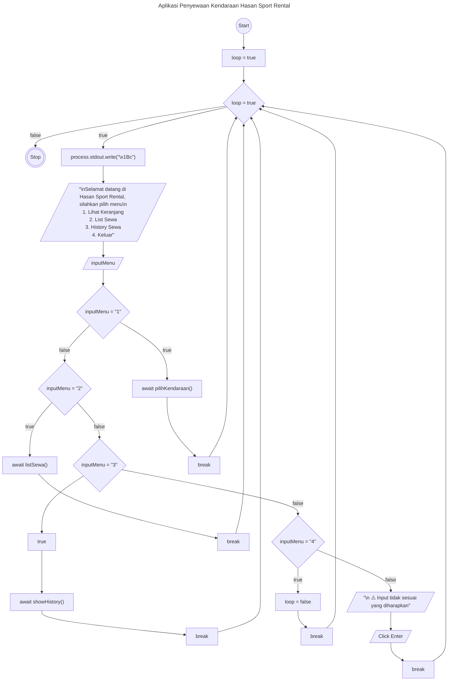

# Flowchart Aplikasi Penyewaan Kendaraan Hasan Sport Rental

```mermaid
---
    title: Aplikasi Penyewaan Kendaraan Hasan Sport Rental
---
flowchart TD
    start@{shape: circle, label: "Start"}
    stop@{shape: dbl-circ, label: "Stop"}

    loop@{shape: rect, label: "loop = true"}
    while@{shape: diamond, label: "loop = true"}
    clear@{shape: rect, label: process.stdout.write("\x1Bc")}
    menu@{shape: lean-r, label: '"\nSelamat datang di Hasan Sport Rental, silahkan pilih menu\n
    1. Lihat Keranjang
    2. List Sewa
    3. History Sewa
    4. Keluar"' }
    inputMenu@{shape: lean-r, label: inputMenu}
    case1@{shape: diamond, label: inputMenu = "1"}
    case2@{shape: diamond, label: inputMenu = "2"}
    case3@{shape: diamond, label: inputMenu = "3"}
    case4@{shape: diamond, label: inputMenu = "4"}

    pilihKendaraan@{shape: rect, label: await pilihKendaraan()}
    listSewa@{shape: rect, label: await listSewa()}
    showHistory@{shape: rect, label: await showHistory()}
    false@{shape: rect, label: loop = false}

    break1@{shape: rect, label: break}
    break2@{shape: rect, label: break}
    break3@{shape: rect, label: break}
    break4@{shape: rect, label: break}
    break5@{shape: rect, label: break}

    outputWarning@{shape: lean-r, label: '"\n ⚠️ Input tidak sesuai yang diharapkan"'}
    inputWarning@{shape: lean-r, label: Click Enter}

    start --> loop --> while -- true --> clear --> menu --> inputMenu --> case1
    case1 -- true --> pilihKendaraan --> break1 --> while
    case1  -- false --> case2 -- true --> listSewa --> break2 --> while
    case2 -- false --> case3 --> true --> showHistory --> break3 --> while
    case3 -- false --> case4 -- true --> false --> break4 --> while
    case4 -- false --> outputWarning --> inputWarning --> break5 -->  while

    while -- false --> stop


```
