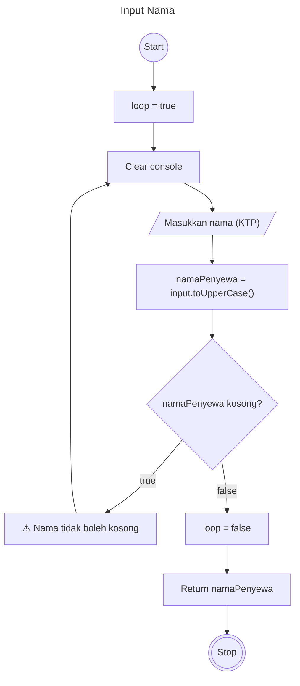
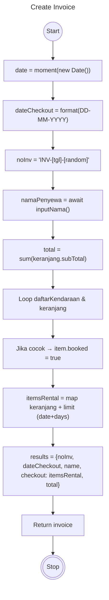
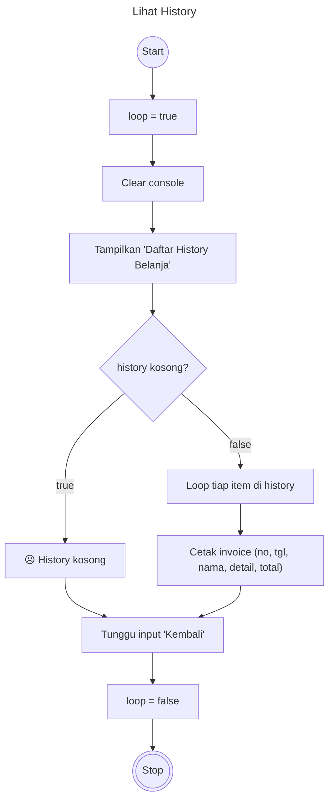

# Flowchart History

## Input Nama

```mermaid
---
title: Input Nama
---
flowchart TD
    start@{shape: circle, label: "Start"}
    stop@{shape: dbl-circ, label: "Stop"}

    loopStart@{shape: rect, label: "loop = true"}
    clear@{shape: rect, label: "Clear console"}
    askName@{shape: lean-r, label: "Masukkan nama (KTP)"}
    toUpper@{shape: rect, label: "namaPenyewa = input.toUpperCase()"}
    checkEmpty@{shape: diamond, label: "namaPenyewa kosong?"}
    errorEmpty@{shape: rect, label: "⚠️ Nama tidak boleh kosong"}
    setLoopFalse@{shape: rect, label: "loop = false"}
    return@{shape: rect, label: "Return namaPenyewa"}

    start --> loopStart --> clear --> askName --> toUpper --> checkEmpty
    checkEmpty -- true --> errorEmpty --> clear
    checkEmpty -- false --> setLoopFalse --> return --> stop
```

## 2. Create Invoice

```mermaid
---
title: Create Invoice
---
flowchart TD
    start@{shape: circle, label: "Start"}
    stop@{shape: dbl-circ, label: "Stop"}

    getDate@{shape: rect, label: "date = moment(new Date())"}
    setDate@{shape: rect, label: "dateCheckout = format(DD-MM-YYYY)"}
    setNoInv@{shape: rect, label: "noInv = 'INV-[tgl]-[random]' "}

    callNama@{shape: rect, label: "namaPenyewa = await inputNama()"}
    calcTotal@{shape: rect, label: "total = sum(keranjang.subTotal)"}

    loopKendaraan@{shape: rect, label: "Loop daftarKendaraan & keranjang"}
    setBooked@{shape: rect, label: "Jika cocok → item.booked = true"}

    mapItems@{shape: rect, label: "itemsRental = map keranjang + limit (date+days)"}
    buildResult@{shape: rect, label: "results = {noInv, dateCheckout, name, checkout: itemsRental, total}"}
    return@{shape: rect, label: "Return invoice"}

    start --> getDate --> setDate --> setNoInv --> callNama --> calcTotal
    calcTotal --> loopKendaraan --> setBooked --> mapItems --> buildResult --> return --> stop
```

## 3. Lihat History

```mermaid
---
title: Lihat History
---
flowchart TD
    start@{shape: circle, label: "Start"}
    stop@{shape: dbl-circ, label: "Stop"}

    loopStart@{shape: rect, label: "loop = true"}
    clear@{shape: rect, label: "Clear console"}
    title@{shape: rect, label: "Tampilkan 'Daftar History Belanja'"}
    checkEmpty@{shape: diamond, label: "history kosong?"}
    showEmpty@{shape: rect, label: "☹️ History kosong"}
    loopHistory@{shape: rect, label: "Loop tiap item di history"}
    printInvoice@{shape: rect, label: "Cetak invoice (no, tgl, nama, detail, total)"}

    waitBack@{shape: rect, label: "Tunggu input 'Kembali'"}
    setLoopFalse@{shape: rect, label: "loop = false"}

    start --> loopStart --> clear --> title --> checkEmpty
    checkEmpty -- true --> showEmpty --> waitBack
    checkEmpty -- false --> loopHistory --> printInvoice --> waitBack --> setLoopFalse --> stop
```
