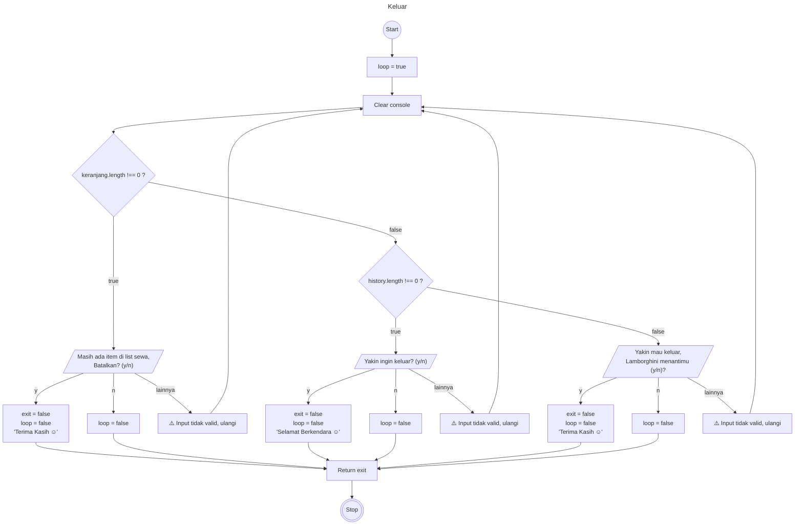

# Flowchart Keluar

```mermaid
---
title: Keluar
---
flowchart TD
    start@{shape: circle, label: "Start"}
    stop@{shape: dbl-circ, label: "Stop"}

    loopStart@{shape: rect, label: "loop = true"}
    clear@{shape: rect, label: "Clear console"}
    checkKeranjang@{shape: diamond, label: "keranjang.length !== 0 ?"}
    checkHistory@{shape: diamond, label: "history.length !== 0 ?"}

    askKeranjang@{shape: lean-r, label: "Masih ada item di list sewa,\nBatalkan? (y/n)"}
    yesKeranjang@{shape: rect, label: "exit = false\nloop = false\n'Terima Kasih ☺️'"}
    noKeranjang@{shape: rect, label: "loop = false"}
    invalidKeranjang@{shape: rect, label: "⚠️ Input tidak valid, ulangi"}

    askHistory@{shape: lean-r, label: "Yakin ingin keluar? (y/n)"}
    yesHistory@{shape: rect, label: "exit = false\nloop = false\n'Selamat Berkendara ☺️'"}
    noHistory@{shape: rect, label: "loop = false"}
    invalidHistory@{shape: rect, label: "⚠️ Input tidak valid, ulangi"}

    askEmpty@{shape: lean-r, label: "Yakin mau keluar,\nLamborghini menantimu (y/n)?"}
    yesEmpty@{shape: rect, label: "exit = false\nloop = false\n'Terima Kasih ☺️'"}
    noEmpty@{shape: rect, label: "loop = false"}
    invalidEmpty@{shape: rect, label: "⚠️ Input tidak valid, ulangi"}
    return@{shape: rect, label: "Return exit"}

    start --> loopStart --> clear --> checkKeranjang
    checkKeranjang -- true --> askKeranjang --> |y| yesKeranjang --> return
    askKeranjang --> |n| noKeranjang --> return
    askKeranjang --> |lainnya| invalidKeranjang --> clear

    checkKeranjang -- false --> checkHistory
    checkHistory -- true --> askHistory --> |y| yesHistory --> return
    askHistory --> |n| noHistory --> return
    askHistory --> |lainnya| invalidHistory --> clear

    checkHistory -- false --> askEmpty --> |y| yesEmpty --> return
    askEmpty --> |n| noEmpty --> return
    askEmpty --> |lainnya| invalidEmpty --> clear
    return --> stop
```
