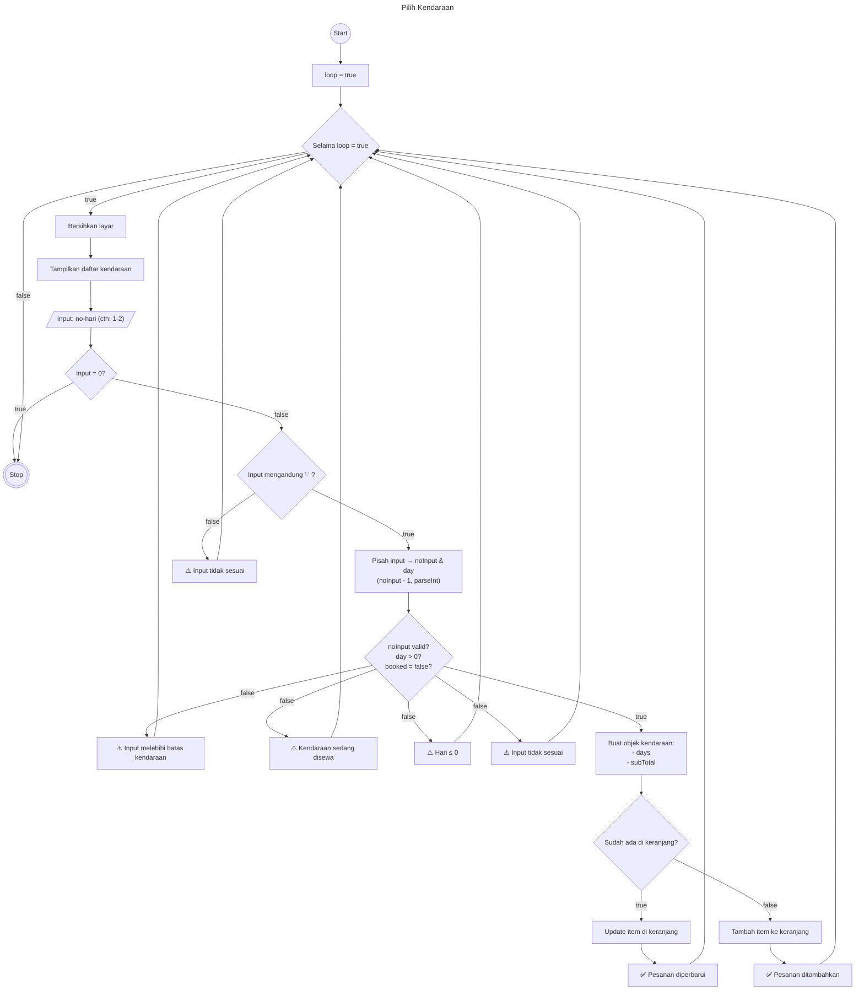

# Flowchart Pilih Kendaraan

```mermaid
---
    title: Pilih Kendaraan
---
flowchart TD
    start@{shape: circle, label: "Start"}
    stop@{shape: dbl-circ, label: "Stop"}

    loop@{shape: rect, label: "loop = true"}
    while@{shape: diamond, label: "Selama loop = true"}
    clear@{shape: rect, label: "Bersihkan layar"}
    showList@{shape: rect, label: "Tampilkan daftar kendaraan"}
    inputMenu@{shape: lean-r, label: "Input: no-hari (cth: 1-2)"}

    caseBack@{shape: diamond, label: "Input = 0?"}
    caseFormat@{shape: diamond, label: "Input mengandung '-' ?"}
    splitInput@{shape: rect, label: "Pisah input → noInput & day
    (noInput - 1, parseInt)"}
    validate@{shape: diamond, label: "noInput valid?\nday > 0?
    booked = false?"}

    errorFormat@{shape: rect, label: "⚠️ Input tidak sesuai"}
    errorRange@{shape: rect, label: "⚠️ Input melebihi batas kendaraan"}
    errorBooked@{shape: rect, label: "⚠️ Kendaraan sedang disewa"}
    errorDay@{shape: rect, label: "⚠️ Hari ≤ 0"}
    errorOther@{shape: rect, label: "⚠️ Input tidak sesuai"}

    createObj@{shape: rect, label: "Buat objek kendaraan:
    - days
    - subTotal"}
    checkKeranjang@{shape: diamond, label: "Sudah ada di keranjang?"}
    updateItem@{shape: rect, label: "Update item di keranjang"}
    addItem@{shape: rect, label: "Tambah item ke keranjang"}
    successUpdate@{shape: rect, label: "✅ Pesanan diperbarui"}
    successAdd@{shape: rect, label: "✅ Pesanan ditambahkan"}

    %% Alur utama
    start --> loop --> while -- true --> clear --> showList --> inputMenu --> caseBack
    caseBack -- true --> stop
    caseBack -- false --> caseFormat
    caseFormat -- false --> errorFormat --> while
    caseFormat -- true --> splitInput --> validate

    validate -- true --> createObj --> checkKeranjang
    validate -- false --> errorRange
    validate -- false --> errorBooked
    validate -- false --> errorDay
    validate -- false --> errorOther

    errorRange --> while
    errorBooked --> while
    errorDay --> while
    errorOther --> while

    checkKeranjang -- true --> updateItem --> successUpdate --> while
    checkKeranjang -- false --> addItem --> successAdd --> while

    while -- false --> stop

```
