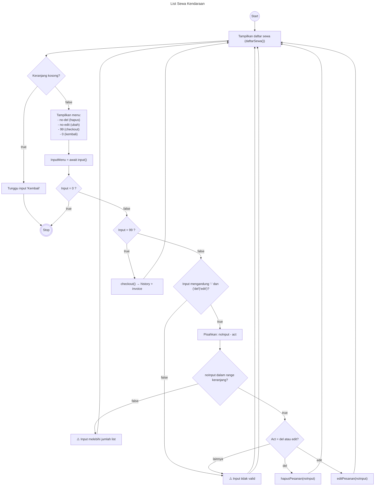
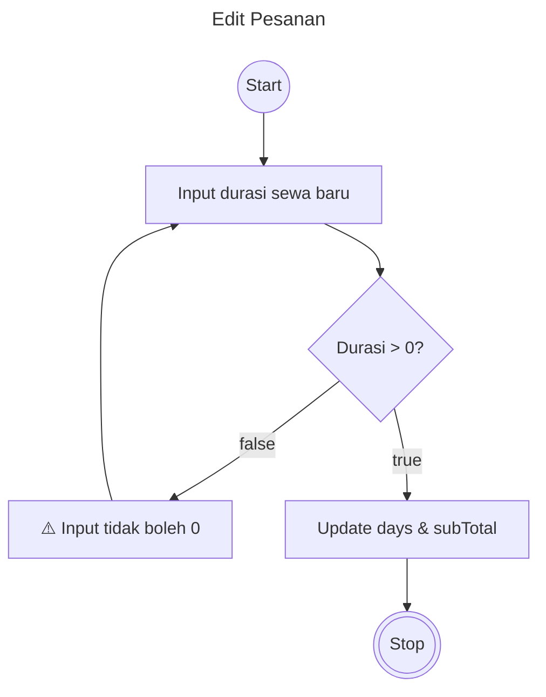
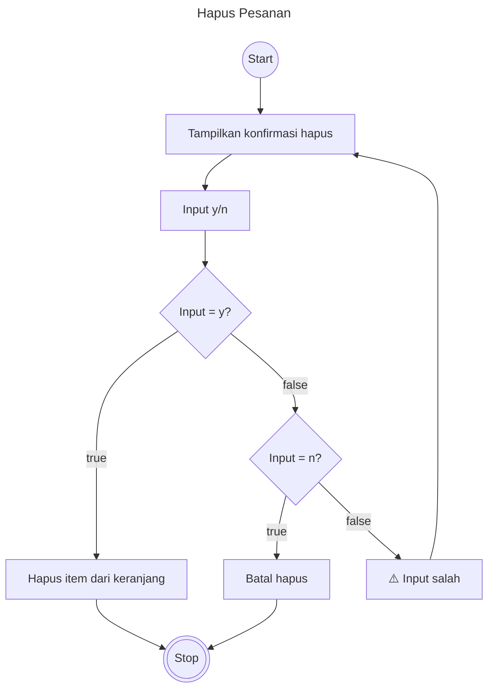
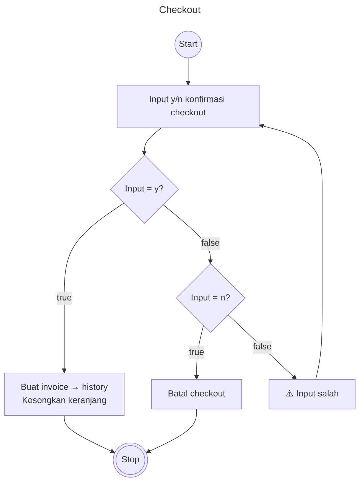

# Flowchart List Sewa Kendaraan

## List Sewa Kendaraan

```mermaid
---
title: List Sewa Kendaraan
---
flowchart TD
    start@{shape: circle, label: "Start"}
    stop@{shape: dbl-circ, label: "Stop"}

    showList@{shape: rect, label: "Tampilkan daftar sewa (daftarSewa())"}
    checkEmpty@{shape: diamond, label: "Keranjang kosong?"}
    waitBack@{shape: rect, label: "Tunggu input 'Kembali'"}

    menu@{shape: rect, label: "Tampilkan menu:
    - no-del (hapus)
    - no-edit (ubah)
    - 99 (checkout)
    - 0 (kembali)"}
    getInput@{shape: rect, label: "InputMenu = await input()"}
    checkBack@{shape: diamond, label: "Input = 0 ?"}
    checkCheckout@{shape: diamond, label: "Input = 99 ?"}
    checkValidAct@{shape: diamond, label: "Input mengandung '-' dan ('del'|'edit')?"}

    errorInput@{shape: rect, label: "⚠️ Input tidak valid"}
    parseInput@{shape: rect, label: "Pisahkan: noInput - act"}
    checkIndex@{shape: diamond, label: "noInput dalam range keranjang?"}
    errorOutOfRange@{shape: rect, label: "⚠️ Input melebihi jumlah list"}

    actionDel@{shape: rect, label: "hapusPesanan(noInput)"}
    actionEdit@{shape: rect, label: "editPesanan(noInput)"}

    checkout@{shape: rect, label: "checkout() → history + invoice"}
    checkAct@{shape: diamond, label: "Act = del atau edit?"}

    start --> showList
    showList --> checkEmpty
    checkEmpty -- true --> waitBack --> stop
    checkEmpty -- false --> menu --> getInput
    getInput --> checkBack
    checkBack -- true --> stop
    checkBack -- false --> checkCheckout
    checkCheckout -- true --> checkout --> showList
    checkCheckout -- false --> checkValidAct
    checkValidAct -- false --> errorInput --> showList
    checkValidAct -- true --> parseInput --> checkIndex
    checkIndex -- false --> errorOutOfRange --> showList
    checkIndex -- true --> checkAct

    checkAct -- del --> actionDel --> showList
    checkAct -- edit --> actionEdit --> showList
    checkAct -- lainnya --> errorInput --> showList
```

## Edit Pesanan

```mermaid
---
title: Edit Pesanan
---
flowchart TD
    start@{shape: circle, label: "Start"}
    stop@{shape: dbl-circ, label: "Stop"}

    inputDays@{shape: rect, label: "Input durasi sewa baru"}
    checkZero@{shape: diamond, label: "Durasi > 0?"}
    error@{shape: rect, label: "⚠️ Input tidak boleh 0"}
    update@{shape: rect, label: "Update days & subTotal"}

    start --> inputDays --> checkZero
    checkZero -- false --> error --> inputDays
    checkZero -- true --> update --> stop
```

## Hapus Pesanan

```mermaid
---
title: Hapus Pesanan
---
flowchart TD
    start@{shape: circle, label: "Start"}
    stop@{shape: dbl-circ, label: "Stop"}

    showConfirm@{shape: rect, label: "Tampilkan konfirmasi hapus"}
    inputConfirm@{shape: rect, label: "Input y/n"}

    checkY@{shape: diamond, label: "Input = y?"}
    checkN@{shape: diamond, label: "Input = n?"}

    actYes@{shape: rect, label: "Hapus item dari keranjang"}
    actNo@{shape: rect, label: "Batal hapus"}
    error@{shape: rect, label: "⚠️ Input salah"}

    start --> showConfirm --> inputConfirm
    inputConfirm --> checkY
    checkY -- true --> actYes --> stop
    checkY -- false --> checkN
    checkN -- true --> actNo --> stop
    checkN -- false --> error --> showConfirm
```

## Checkout

```mermaid
---
title: Checkout
---
flowchart TD
    start@{shape: circle, label: "Start"}
    stop@{shape: dbl-circ, label: "Stop"}

    confirm@{shape: rect, label: "Input y/n konfirmasi checkout"}
    checkY@{shape: diamond, label: "Input = y?"}
    checkN@{shape: diamond, label: "Input = n?"}
    actYes@{shape: rect, label: "Buat invoice → history\nKosongkan keranjang"}
    actNo@{shape: rect, label: "Batal checkout"}
    error@{shape: rect, label: "⚠️ Input salah"}

    start --> confirm
    confirm --> checkY
    checkY -- true --> actYes --> stop
    checkY -- false --> checkN
    checkN -- true --> actNo --> stop
    checkN -- false --> error --> confirm
```
